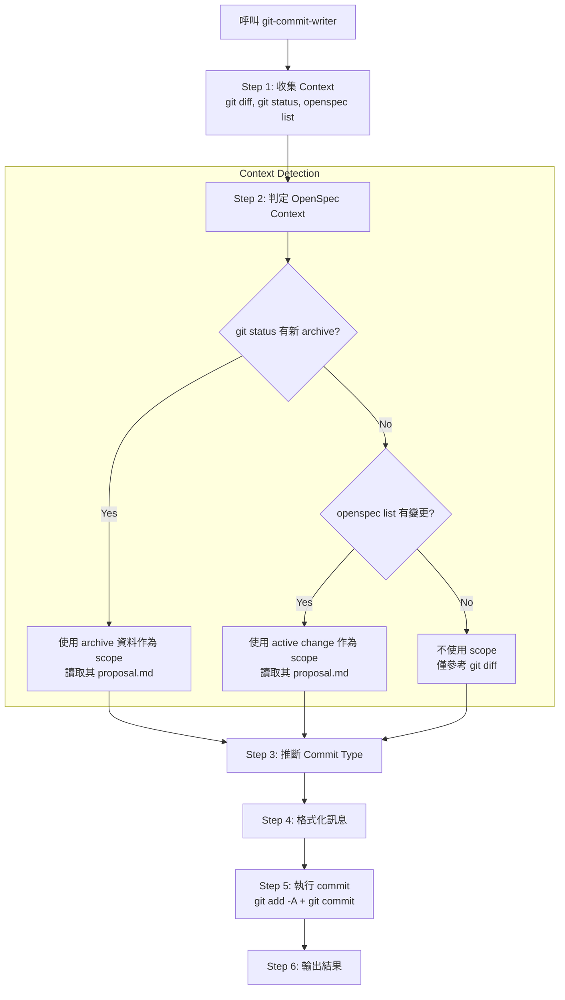

# Git Commit Writer

`git-commit-writer` 是一個專門用來生成符合 [Conventional Commits](https://www.conventionalcommits.org/) 規範之 git commit 的工具。它可以作為 `openspec-commit` 流程的一部分，也可以獨立呼叫。

---

## 核心功能

1. **自動 context 偵測**：自動識別當前是否有 OpenSpec change (archived 或 active)，並據此決定是否加上 scope。
2. **語意化 Commit Type**：根據 `git diff` 內容自動推斷 type (feat, fix, docs, refactor, chore, test)。
3. **高品質 Subject/Body**：從 `proposal.md` 或 diff 內容推斷變更的原因 (Why) 與細節 (What)。
4. **Co-Authored-By 注入**：自動在 commit footer 加入執行該操作的 AI 模型名稱。
5. **即刻執行**：生成後不需額外確認，直接執行 `git commit`。

---

## 運作流程



---

## Commit 格式規範

### 帶有 OpenSpec Context
```
<type>(<change-id>): <subject>

<body>

Co-Authored-By: <Model Name> <noreply@anthropic.com>
```

### 無 OpenSpec Context
```
<type>: <subject>

<body>

Co-Authored-By: <Model Name> <noreply@anthropic.com>
```

---

## Type 推斷原則

| 變更性質 | Type | 範例 |
| :--- | :--- | :--- |
| **新功能 / 新能力** | `feat` | 新增資料來源、新工具、新 Skill |
| **修復錯誤** | `fix` | 修正爬蟲解析邏輯、修正邏輯錯誤 |
| **重構** | `refactor` | 結構調整、不改變外部行為的程式優化 |
| **文件** | `docs` | 僅修改 `docs/` 或 `README.md` |
| **腳本、設定、維護** | `chore` | 修改 `.gitignore`、更新 dependencies、調整 CI |
| **測試** | `test` | 新增或修正測試案例 |

---

## 獨立使用方式

如果你已經手動實作完畢，想直接提交：

1. **Claude Code**: 直接輸入 `@"git-commit-writer (agent)"`
2. **Antigravity (Slash Command)**: 輸入 `/opsx-commit` (如果包含 archive 流程) 或 `/git-commit` (如果有對應配置)

> [!TIP]
> **自動偵測優先序**：`git-commit-writer` 會優先尋找 `git status` 中剛被搬移至 `openspec/changes/archive/` 的目錄。這對 `openspec-commit` 流程非常友善。

---

## 相關組件

- **Skill**: `template/common/skills/git-commit-writer/SKILL.md`
- **Agent**: `template/common/.claude/agents/git-commit-writer.md`
- **Workflow**: `openspec-commit-workflow.md`
