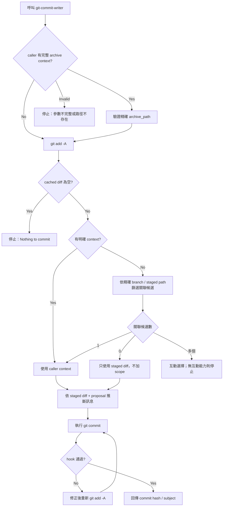

# Git Commit Writer

`git-commit-writer` 是一個專門用來生成符合 [Conventional Commits](https://www.conventionalcommits.org/) 規範之 git commit 的工具。它可以作為 `openspec-commit` 流程的一部分，也可以獨立呼叫。

---

## 核心功能

1. **精確 context 優先**：caller 提供 `archive_path` 與 `change_id` 時直接驗證並使用；只有獨立呼叫才依 branch 與 staged path 的明確關聯自動偵測。
2. **語意化 Commit Type**：根據 `git diff` 內容自動推斷 type (feat, fix, docs, refactor, chore, test)。
3. **高品質 Subject/Body**：從 `proposal.md` 或 diff 內容推斷變更的原因 (Why) 與細節 (What)。
4. **可追溯的 AI attribution**：以執行工具寫入 `Co-Authored-By`，並以
   `AI-Assisted-By` 記錄主要實作模型。
5. **完整 staging guard**：先 `git add -A`，空 staged diff 不 commit；hook 修正後重新 staging。
6. **即刻執行**：生成後不需額外確認，直接執行 `git commit`。

---

## 運作流程



---

## OpenSpec context

`openspec-commit` 會傳入一組不可拆分的值：

```text
archive_path=<exact archived change directory>
change_id=<OpenSpec change id without date prefix>
tool_name=<executing agent tool>
assisting_model=<primary implementation model>
```

archive context 少一個值或路徑不存在就停止，不可改抓「最新」archive。
`assisting_model` 為選填；缺少模型名稱不阻擋 commit。
commit-only agent 必須保留 caller 傳入的 root-session 主要實作模型，不可換成自己的模型。
`assisting_model` 只用於 `AI-Assisted-By` trailer，不得覆寫 commit-only agent
既有的 runtime model 或 reasoning effort。優先原樣使用使用者為本次工作提供的
模型名稱，否則自動記錄目前可確認的 root-session 模型；接受 `GPT-5.6`、`GPT-6`，
不補猜 variant、版本或 context size。同一 session 模型未切換時持續沿用，不重問。
工具名稱如 `OpenAI Codex` 不當作模型名稱；模型完全未知，或跨 session／模型切換
造成歧義且無已確認 attribution 時，省略整行 `AI-Assisted-By` 並回報，不填空值或
placeholder，也不阻擋 commit。不透過文件、環境變數、session logs、Git history
或 commit-only agent 自己的模型推測主要實作模型。
獨立呼叫且沒有
context 時，先完成 staging，再依以下明確證據篩選候選：

| 候選 | 必要關聯證據 |
|---|---|
| Active change | 存在於 `openspec list --json`，且目前 branch 正好是 `feature/<change-id>`，或 staged path 位於 `openspec/changes/<change-id>/` |
| Archived change | staged path 位於該筆精確的 `openspec/changes/archive/<archive-directory>/` |

候選數只用來處理篩選後的歧義，不能取代關聯證據：零筆時使用無 scope 的
staged diff；一筆時使用其 context；多筆時互動選擇，無互動能力則停止。
即使目前只有一筆 active change，只要沒有上述關聯，也必須忽略。

### 無關 active change 重播案例

下列是歷史錯誤輸入形狀的安全重播，不會實際建立 commit：

```text
branch: main
cached paths: docs/hooks/codex.md, docs/hooks/antigravity.md
active changes: add-mutation-check
association: none
expected: docs: <subject>
forbidden: docs(add-mutation-check): <subject>
```

---

## Commit 格式規範

### 帶有 OpenSpec Context
```
<type>(<change-id>): <subject>

<body>

Co-Authored-By: <tool name> <verified provider email when mapped>
AI-Assisted-By: <primary implementation model>
```

### 無 OpenSpec Context
```
<type>: <subject>

<body>

Co-Authored-By: <tool name> <verified provider email when mapped>
AI-Assisted-By: <primary implementation model>
```

目前驗證的 mapping 只有 `Codex <noreply@openai.com>` 與
`Claude Code <noreply@anthropic.com>`。未知 mapping 只寫
`Co-Authored-By: <tool name>`，不得猜測 email。

---

## Type 推斷原則

| 變更性質 | Type | 範例 |
| :--- | :--- | :--- |
| **新功能 / 新能力** | `feat` | 新增資料來源、新工具、新 Skill |
| **修復錯誤** | `fix` | 修正爬蟲解析邏輯、修正邏輯錯誤 |
| **重構** | `refactor` | 結構調整、不改變外部行為的程式優化 |
| **文件** | `docs` | 僅修改 `docs/` 或 `README.md` |
| **腳本、設定、維護** | `chore` | 修改 `.gitignore`、更新 dependencies、調整 CI |
| **測試** | `test` | 新增或修正測試案例 |

---

## 獨立使用方式

如果你已經手動實作完畢，想直接提交：

1. **Claude Code**：輸入 `@"git-commit-writer-agent"`
2. **支援 project skill 的 host**：呼叫 `git-commit-writer`
3. **完整 OpenSpec 收尾**：改呼叫 `openspec-commit`，由協調層傳入精確
   archive context

> [!TIP]
> 自動偵測只供獨立呼叫。`openspec-commit` 一律傳入精確的
> `archive_path`、`change_id`、`tool_name` 與 `assisting_model`。

---

## 相關組件

- **Skill**: `template/common/skills/git-commit-writer/SKILL.md`
- **Agent**: `template/common/.claude/agents/git-commit-writer-agent.md`
- **Codex agent**: `template/common/.codex/agents/git-commit-writer-agent.toml`
  （`gpt-5.6-luna`、medium）
- **Installed portable skill**: `.claude/skills/git-commit-writer/SKILL.md`、
  `.agents/skills/git-commit-writer/SKILL.md`
- **Workflow**: [OpenSpec Commit Workflow](/docs/workflow/commit.md)

# Citations

[1] [Conventional Commits](https://www.conventionalcommits.org/)
