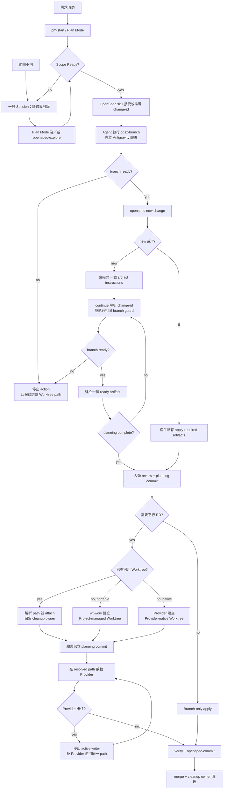

# PM/RD 多 Agent 協作工作流

本流程把需求探索、OpenSpec change、Git branch、Worktree 與 AI session 視為
不同責任。Worktree 是平行開發的隔離工具，不是 OpenSpec 或單一 Session
開發的必要條件。

## 責任邊界

| Lifecycle | 管理內容 | 主要動作 |
|---|---|---|
| OpenSpec | change artifacts 與主規格 | explore → ff → apply → verify → commit/archive |
| Git | branch、worktree、merge 與清理 | branch → optional worktree → merge → cleanup |
| Provider session | 對話、Plan Mode、session resume | start → resume → prompt |

三者可以由同一個工具協調，但不能互相隱式代替。例如，進入 Plan Mode 不代表
已建立 OpenSpec change；執行 `$openspec-ff-change` 也不應自行決定是否建立
Worktree。

## Phase 1：PM 規劃

### 兩種入口

| 入口 | 適用情境 | 流程 |
|---|---|---|
| 直接規劃 | 已清楚知道要做什麼 | `pm-start` → Provider 原生 Plan Mode |
| 探索後規劃 | 問題或範圍尚未釐清 | 一般 Session → 讀取專案、來回討論 → Plan Mode 及／或 `$openspec-explore` |

`pm-start` 是可選的 session launcher，只負責在 repository root 啟動或恢復
PM session，並在 Provider 支援時進入原生 Plan Mode。它不應自動建立 change、
branch 或 worktree。

Plan Mode 與 `$openspec-explore` 也不是二選一：前者是 Provider 的執行／權限
模式，後者是「只探索、不實作」的跨 Provider 思考姿態。

### Scope Ready 關卡

兩種入口都必須先收斂到 **Scope Ready**：

- 問題、預期行為與不做的範圍已足以撰寫規格。
- 已有明確的 change ID，或需求描述已足以讓 OpenSpec skill 推導唯一的
  kebab-case change ID。
- 人類準備開始 review 持久化的 proposal、design、specs 與 tasks。

在 Scope Ready 之前，不需要為探索中的想法建立 branch 或 change。

### OpenSpec 規劃入口

三個規劃 action 的責任不同；artifact 順序由 schema 決定，不由 workflow script
寫死：

| Action | Change 狀態 | 單次執行結果 |
|---|---|---|
| `$openspec-new-change`／`/opsx:new` | 建立新 change | 建立 scaffold、顯示第一個 ready artifact 的 instructions，尚不寫入 artifact |
| `$openspec-ff-change`／`/opsx:ff` | 建立新 change | 建立 scaffold，接著產生所有 apply-required artifacts |
| `$openspec-continue-change`／`/opsx:continue` | 繼續既有 change | 解析 change ID，依 status 建立一個 ready artifact |

目前 `spec-driven` schema 的常見順序是
`proposal → specs → design → tasks`；其他 schema 一律遵循 `openspec status` 與
`openspec instructions` 回傳的 dependencies。

### Change ID 與 Branch Preparation

> [!NOTE]
> Agent-mediated branch preparation 已寫入 managed operating protocol，適用於
> 所有 AGENTS.md-aware Provider。它不修改或覆蓋 OpenSpec 產生的 skills／commands。

`new` 與 `ff` 都在 skill 接受或推導 change ID 後、執行
`openspec new change` 前準備 branch：

```text
Scope Ready
    ↓
OpenSpec skill 接受或推導 <change-id>
    ↓
Agent 執行 opsx-branch <change-id>
    ├─ non-zero → 停止目前 action，回報錯誤或既有 Worktree path
    └─ exit 0
         ↓
openspec new change <change-id>
    ↓
new：顯示第一個 artifact instructions 並停止
ff ：繼續產生所有 apply-required artifacts
    ↓
人類 review artifacts
    ↓
commit 規劃文件到 feature/<change-id>
```

`continue` 不會再執行 `openspec new change`，因此不能依賴 change-creation hook。
目標流程是在解析既有 change ID 後、讀取 status 或寫入下一份 artifact 前執行相同
branch guard：

```text
continue 解析 <change-id>
    ↓
Agent 執行 opsx-branch <change-id>
    ├─ non-zero → 停止，不建立下一份 artifact
    └─ exit 0 → status → instructions → 建立一份 ready artifact
```

若 `feature/<change-id>` 已由另一個 registered Worktree 持有，`opsx-branch` 會回傳
non-zero 並顯示該 path。Agent 應停止，不能自動切換 cwd、接手該 Worktree 或啟動
另一個 Session；這保留既有的 single-active-writer 邊界。

`openspec-branch-creator` 的 PostToolUse hook 繼續保留，處理人工直接執行
`openspec new change`、舊版 entrypoint，或 Agent 未先執行 branch preparation 的
情境。hook 與 Agent-mediated 路徑都呼叫同一個 `opsx-branch` 核心；若 hook
在 change scaffold 建立後才切換 branch，未 commit 的 scaffold 會隨 checkout 留在
feature branch，不會進入 main 的 Git 歷史。

workflow installer 會為 Claude Code、Codex 與 GitHub Copilot CLI 安裝此 fallback；
Antigravity 不安裝廣泛 shell hook。Codex 若已有從 Claude 遷移的相同 entry，安裝時
不會重複加入；新安裝或腳本更新後仍應在 Codex `/hooks` 確認 trusted／enabled。

## Phase 2：RD 實作

規劃通過並 commit 後，再依是否需要平行工作選擇執行模式。

| 模式 | 適用情境 | Provisioner / cleanup owner | 啟動方式 |
|---|---|---|---|
| Branch-only | 同一個 Session 依序規劃與實作 | 無 | 留在 `feature/<change-id>` 執行 apply |
| Project-managed Worktree | `wt-work` 的預設；需要平行 RD 或跨 Provider failover | `wt-work` / `wt-done` | `wt-work <change-id> --agent <provider>` |
| Provider-native Worktree | 已由 Provider 建立隔離 checkout | 建立它的 Provider | `wt-work <change-id> --agent <provider> --path <path>`；省略 `--path` 時安全搜尋 |

> [!WARNING]
> 每個 Worktree 同一時間只能有一個 active writer。Provisioner／cleanup owner
> 可以和目前執行的 Provider 不同，但不得讓第二個 Provider 再建立同一工作的
> Worktree。

RD 在選定的 checkout 中執行：

```text
$openspec-apply-change <change-id>
    ↓
$openspec-verify-change <change-id>
    ↓
$openspec-commit <change-id>
```

Provider 可使用自己的 native alias，但同一個 action 只能選 native alias 或
portable skill 其中一個，不能重複執行。

### 跨 Provider failover

Provider 卡住時，先停止它與仍在執行的 subagents，再讓另一個 Provider 進入
**同一個 Worktree path**。接手者不得使用 `claude -w`、Codex Worktree 或
Antigravity New Worktree 再建立 checkout；它應直接從既有 cwd 啟動並重新讀取
OpenSpec artifacts、Git diff、測試結果與未完成 task。

同機接手允許 Worktree 保持 dirty；是否先建立 checkpoint commit 由使用者依工作
狀態決定。跨機器或 Provider-managed Worktree 可能被清理時，才必須先保存可攜
的 commit／patch。

`wt-work <change-id> --agent <provider>` 在未指定 `--session` 時一定啟動新的
Provider session；只有明確 `--session` 才 resume 並帶入 apply intent。`wt-resume`
只恢復同一 Provider 的 session，不帶入 apply intent，session history 不會跨
Provider 轉移。若改在另一台機器接手，先 commit／push named branch，再建立新的
Worktree。

原生預設位置、path discovery 與接手命令見
[Provider-native Worktree Reference](/docs/workflow/provider-worktrees.md)。

## Phase 3：合併與清理

- `wt-work` 建立的 `.worktrees/<change-id>` 使用 `wt-done <change-id>` 合併並
  清理。
- Branch-only 模式可在沒有其他 checkout 持有該 branch 時使用 `wt-done` 作為
  本地 merge helper，或手動完成 merge 與 branch cleanup。
- Attach 的 Provider-native Worktree 保留原 cleanup owner；第一版不移交給
  `wt-done`，也不從目錄名稱猜測並刪除。

`wt-done` 目前是 local-only：不包含 push、PR、遠端 branch 刪除或 code review
gate。

## 完整狀態圖



底層概念見 [OpenSpec、Git 與 Session 邊界](/docs/workflow/concepts.md)，
`wt-work` 的現行 branch resolution 見
[wt-work Worktree and Branch Resolution Flow](/docs/workflow/wt-work-flow.md)。

## 目標 Provider 矩陣

| Provider | PM / RD 目標 | OpenSpec 入口原則 |
|---|---|---|
| Claude Code | 支援 | native OPSX alias 或 portable skill，擇一 |
| Codex | 支援 | portable skill |
| Antigravity (`antigravity`／`agy`) | 支援 | native workflow 或 portable skill，擇一 |
| GitHub Copilot CLI | 支援 | portable skill |
| Gemini CLI | 移除 | 已不列入目標矩陣 |

Worktree core 應保持 Provider-neutral；Provider adapter 只負責在指定 cwd 中啟動、
恢復 session 與傳入 prompt。

各 Provider surface 是否原生建立 Worktree、預設位置與 checkout 行為，集中記錄於
[Provider-native Worktree Reference](/docs/workflow/provider-worktrees.md)。

## 已確認的實作決策

本次重構採用以下邊界：

1. `wt-work` 預設建立 Project-managed Worktree；Provider-native 是 attach-only
   的外部入口。
2. `--path` 明確指定時優先使用；省略時只從 Git Worktree registry 自動選擇唯一
   可驗證候選。零個候選才建立 Project-managed Worktree，多個候選則停止並列出
   path，不保存額外 mapping registry。
3. 同機 failover 允許 verified dirty Worktree；停止原 active writer 後即可接手，
   checkpoint commit 是情境式選項，不是 gate。
4. Cleanup ownership 不因 attach 或 Provider 切換而移交；`wt-done` 只清理
   Project-managed Worktree。
5. Project-managed Worktree 保留 `.env`，並只複製所選 LLM Provider 已知且存在的
   local settings；不自動建立 Codex `.worktreeinclude`，也不隱式安裝 dependencies。

## 相關文件

- [OpenSpec、Git 與 Session 邊界](/docs/workflow/concepts.md)
- [wt-work Worktree and Branch Resolution Flow](/docs/workflow/wt-work-flow.md)
- [Provider-native Worktree Reference](/docs/workflow/provider-worktrees.md)
- [OpenSpec Commit Workflow](/docs/workflow/commit.md)
- [Workflow 腳本手冊](/scripts/workflow/README.md)
