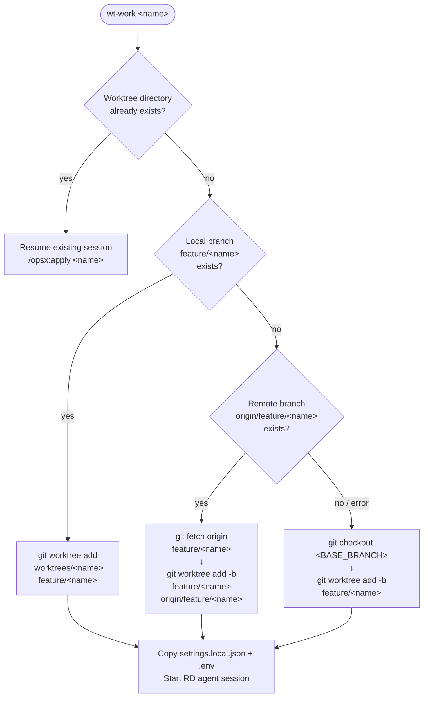

# wt-work Branch Resolution Flow

`wt-work <name>` resolves the `feature/<name>` branch through three paths before creating a worktree.

## Branch Resolution Flowchart



## Path Details

### Path 1 — Local branch exists

**Trigger:** PM agent ran `openspec new change <name>` on the **same machine** and the `openspec-branch-creator` PostToolUse hook created `feature/<name>` automatically.

```bash
git worktree add .worktrees/<name> feature/<name>
```

No `-b` flag — the branch already exists locally.

### Path 2 — Remote-only branch (cross-machine)

**Trigger:** PM is on machine A and pushed `feature/<name>` to remote. RD is on machine B where the branch does not yet exist locally.

```bash
git fetch origin feature/<name>
git worktree add .worktrees/<name> -b feature/<name> origin/feature/<name>
```

Creates a local tracking branch from the remote and adds the worktree.

**Fallback:** If `git ls-remote` fails (no remote configured, network error), this path is skipped and Path 3 runs.

### Path 3 — No branch anywhere (legacy / standalone)

**Trigger:** Neither local nor remote branch exists. This is the original behavior: start fresh from `BASE_BRANCH`.

```bash
git checkout <BASE_BRANCH>
git worktree add .worktrees/<name> -b feature/<name>
```

## Cross-Machine Scenario

```
Machine A (PM)                          Machine B (RD)
──────────────────────────────          ──────────────────────────────
pm-start
  └─ /opsx:ff feature-x
       └─ openspec new change feature-x
            └─ hook creates feature/feature-x ──► git push origin feature/feature-x
                                                         │
                                          wt-work feature-x
                                            └─ ls-remote detects branch
                                                 └─ fetch + worktree add
                                                      └─ RD agent starts
```

> **Note:** The push from Machine A to remote is a manual step (or can be automated separately). `wt-done` is currently **local-only** — see [guide.md](guide.md) for details.
