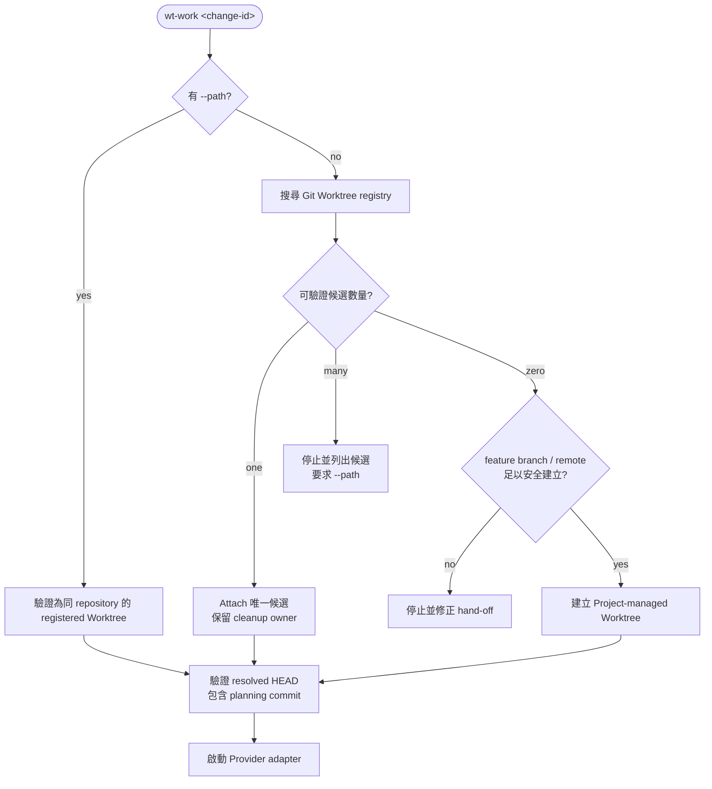
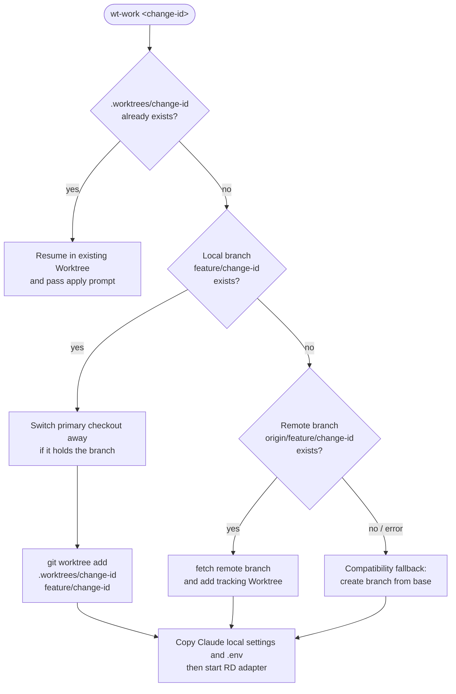

# wt-work Worktree and Branch Resolution Flow

`wt-work <change-id>` 是 **PM 規劃完成後**的可選 RD hand-off。它負責解析
既有 Worktree 或 `feature/<change-id>`，只在沒有可用 Worktree 時建立
`.worktrees/<change-id>`，再由 Provider adapter 啟動 RD Session；它不負責
釐清需求或建立 OpenSpec change。

> [!NOTE]
> 現行腳本只辨識固定的 `.worktrees/<change-id>`。`--path`、Git registry 自動搜尋、
> cross-provider new session、Provider local settings、cleanup owner 與 active
> writer gate 都是目標契約，尚未實作。

## 標準前置條件

- OpenSpec change 已達 apply-ready，並經人類 review。
- 規劃 artifacts 已 commit 到 `feature/<change-id>`，且精確 `planning_commit`
  已知。
- 若 Worktree 已存在，取得 Git registry 中的精確 path 與 branch／detached 狀態。
- 原 active writer 與其 subagents 已停止。
- Cleanup owner 已知；attach 不會隱式轉移 ownership。

## Target Worktree Resolution


```mermaid
flowchart TD
    A([wt-work &lt;change-id&gt;]) --> B{有 --path?}
    B -- yes --> C[驗證為同 repository 的 registered Worktree]
    B -- no --> D[搜尋 Git Worktree registry]
    D --> E{可驗證候選數量?}
    E -- one --> K[Attach 唯一候選<br/>保留 cleanup owner]
    E -- many --> H[停止並列出候選<br/>要求 --path]
    E -- zero --> F{feature branch / remote<br/>足以安全建立?}
    C --> G[驗證 resolved HEAD<br/>包含 planning commit]
    K --> G
    F -- no --> I[停止並修正 hand-off]
    F -- yes --> J[建立 Project-managed Worktree]
    J --> G
    G --> L[啟動 Provider adapter]
```

`--path` 優先於自動搜尋，且必須指向同一 repository 已註冊的 Worktree。未提供時，
`git worktree list --porcelain` 是唯一搜尋來源：先找固定 project path 或 exact
`feature/<change-id>`，再嘗試唯一且同時包含 active change 與 `planning_commit`
的 detached 候選。候選不唯一時停止並要求 `--path`；不保存額外 mapping。

Attach 或建立完成後，還必須驗證 resolved HEAD 包含 `planning_commit`，才能進入
apply。零個既有候選時，預設建立 Project-managed Worktree。

## Current Branch Resolution


```mermaid
flowchart TD
    A([wt-work &lt;change-id&gt;]) --> B{.worktrees/change-id<br/>already exists?}
    B -- yes --> C[Resume in existing Worktree<br/>and pass apply prompt]
    B -- no --> D{Local branch<br/>feature/change-id<br/>exists?}
    D -- yes --> E[Switch primary checkout away<br/>if it holds the branch]
    E --> F[git worktree add<br/>.worktrees/change-id<br/>feature/change-id]
    D -- no --> G{Remote branch<br/>origin/feature/change-id<br/>exists?}
    G -- yes --> H[fetch remote branch<br/>and add tracking Worktree]
    G -- no / error --> I[Compatibility fallback:<br/>create branch from base]
    F --> J[Copy Claude local settings and .env<br/>then start RD adapter]
    H --> J
    I --> J
```

## Path Details

### Path 1 — Local branch exists

**標準觸發條件：** PM 在同一台機器完成 branch-first 規劃，並將 artifacts commit
到 `feature/<change-id>`。

若 branch 仍 checkout 在 primary worktree，`wt-work` 會先將 primary checkout
切回 base branch，再執行：

```bash
git worktree add .worktrees/<change-id> feature/<change-id>
```

沒有 `-b`，因為 branch 已存在；RD 會直接繼承 PM 的規劃 commit。

### Path 2 — Remote-only branch

**觸發條件：** PM 在機器 A 推送 `feature/<change-id>`，RD 在機器 B 尚無本地
branch。

```bash
git fetch origin feature/<change-id>
git worktree add .worktrees/<change-id> \
  -b feature/<change-id> origin/feature/<change-id>
```

`git ls-remote` 失敗時，現行腳本會跳到 Path 3。這可能同時代表 branch 不存在、
沒有 remote 或網路錯誤，因此未來不應把所有失敗都解讀成「可以安全新建」。

### Path 3 — No branch anywhere

現行腳本會從 base branch 建立新 branch 與 Worktree：

```bash
git checkout <base-branch>
git worktree add .worktrees/<change-id> -b feature/<change-id>
```

這是 legacy / standalone 相容路徑，不是標準 PM → RD hand-off。它只建立 Git
branch 與 Worktree，不會建立或驗證 OpenSpec artifacts；若使用者原本期待接續
已 review 的 change，應停止並修正 hand-off，而不是在空 branch 直接 apply。

## Cross-Machine Scenario

```text
Machine A (PM)                          Machine B (RD)
──────────────────────────────          ──────────────────────────────
scope ready
  └─ create feature/change-id
       └─ openspec-ff-change
            └─ human review + commit
                 └─ git push origin feature/change-id
                                      │
                                      └─ wt-work change-id
                                           └─ fetch + worktree add
                                                └─ RD apply session
```

Remote push 仍是手動步驟；`wt-done` 也仍是 local-only。

## Provider Adapter Boundary

Worktree resolution 完成後，Provider adapter 才接手：

```text
start_session(provider, cwd=<resolved-path>, apply_prompt)
resume_session(provider, cwd=<resolved-path>, session, apply_prompt)
```

Adapter 只處理 Provider 的 cwd、session 與 prompt 差異，不應重新建立 branch、
Worktree 或 OpenSpec change。切換 Provider 時停止舊 active writer，再以相同
`resolved-path` 啟動新 adapter；這是目標 `wt-work` 的 new-session 路徑。
`wt-resume` 只恢復同一 Provider 的 session，session history 不會跨 Provider
轉移。現行 `wt-work` 遇到既有目錄仍會 resume，尚未實作此分流。

Project-managed Worktree 建立後，core 複製 `.env`，Provider adapter 只複製所選
LLM Provider 已知且存在的 local settings。它不複製所有 Provider 設定，也不
自動安裝 dependencies。

目標 Provider 矩陣與現行缺口見
[PM/RD 多 Agent 協作工作流](/docs/workflow/guide.md#目標-provider-矩陣)。

## 相關文件

- [PM/RD 多 Agent 協作工作流](/docs/workflow/guide.md)
- [OpenSpec、Git 與 Session 邊界](/docs/workflow/concepts.md)
- [Provider-native Worktree Reference](/docs/workflow/provider-worktrees.md)
- [Workflow 腳本手冊](/scripts/workflow/README.md)
